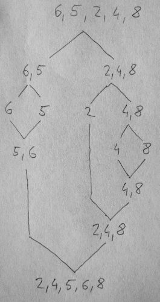
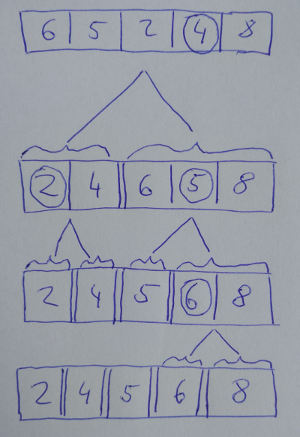

# 6. Problematika řazení

> Problematika řazení – základní algoritmy a jejich složitost.

## Formální definice

 ... abeceda, nad kterou je dáno řazení

 ... posloupnost (slovo) nad abecedou 

Cílem je nalézt permutaci  takovou, že posloupnost  je setříděná, tj. 

## Vlastnosti

- *na místě* - pro řazení se nepoužívá žádná další datová struktura (např. další pole)
- *stabilní* - v seřazené posloupnosti je zachováno pořadí rovnocenných prvků
- *přirozený* - rychleji zpracuje (částečně) seřazenou množinu, u nepřirozeného to nehraje roli
- [*interní*](https://en.wikipedia.org/wiki/Internal_sort) - všechna data jsou k dispozici v paměti
- [*externí*](https://en.wikipedia.org/wiki/External_sorting) - další prvky přichází v průběhu řazení
- složitost 
 - [*časová složitost*](https://cs.wikipedia.org/wiki/Asymptotick%C3%A1_slo%C5%BEitost) (dále jako ) viz okruh [7 - Časová náročnost algoritmů](https://github.com/tomaskrizek/tul-szz-it-nv/blob/master/07_casova_narocnost_algoritmu/07_casova_narocnost_algoritmu.md)
 - *paměťová složitost*

## Rozlišujeme

a. Postupné rozšřování setříděné části
- Selection sort 
- Insertion sort 

b. Záměnu dvojic po sobě jsdoucích prvků
- Bubble sort 
- Sinking sort 
- Shaker 

c. Divide and Conquer
- Merge sort 
- Quick sort 

d. Sorting by distribution
 - Radix sort
 - Bucket sort

| Anglicky       | Česky             | Nejlepší   | Průměrně   | Nejhorší   | Dodatečná pamět | Stabilní  | Přirozené | Metoda    |
|----------------|-------------------|------------|------------|------------|-----------------|-----------|-----------|-----------|
| Selection sort | Řazení výběrem    | O(n²)      | O(n²)      | O(n²)      | O(1)            | zprav. ne | ne        | výběr     |
| Insertion sort | Řazení vkládáním  | O(n)       | O(n²)      | O(n²)      | O(1)            | ano       | ano       | vkládání  |
| Bubble sort    | Bublinkové řazení | O(n)       | O(n²)      | O(n²)      | O(1)            | ano       | ano       | záměna    |
| Merge sort     | Řazení slučováním | O(n log n) | O(n log n) | O(n log n) | O(log n)        | ano       | ano       | slučování |
| Quicksort      | Rychlé řazení     | O(n log n) | O(n log n) | O(n²)      | O(log n)        | ne        | ne        | záměna    |

[Sorting Algorhitm Animations](http://www.sorting-algorithms.com/)

[Rozbor mnoha algoritmu](https://www.algoritmy.net/article/75/Porovnani-algoritmu)

## a) Rozšřování setříděné části

### Selection Sort

V každém kroku vybere z nesetříděné části nejmenší prvek a vloží nakonec setříděné části.

**Příklad:**

- 6, 5, 2, 4, 8
- **2**, 5, 6, 4, 8
- **2**, **4**, 6, 5, 8
- **2**, **4**, **5**, 6, 8
- **2**, **4**, **5**, **6**, 8
- **2**, **4**, **5**, **6**, **8**

- [Řazení výběrem (cs wiki)](https://cs.wikipedia.org/wiki/%C5%98azen%C3%AD_v%C3%BDb%C4%9Brem)
- [Selection Sort (en wiki)](https://en.wikipedia.org/wiki/Selection_sort)

### Insertion Sort

Vyberu první prvek z nesetříděné části a zařadím ho na správné místo v setříděné části.

**Příklad:**

- 6, 5, 2, 4, 8
- **6**, 5, 2, 4, 8
- **5**, **6**, 2, 4, 8
- **2**, **5**, **6**, 4, 8
- **2**, **4**, **5**, **6**, 8
- **2**, **4**, **5**, **6**, **8**

v nejhorším případě ... 

pro téměř seřazenou posloupnost ... 

- [Řazení vkládáním (cs wiki)](https://cs.wikipedia.org/wiki/%C5%98azen%C3%AD_vkl%C3%A1d%C3%A1n%C3%ADm)
- [Insertion Sort (en wiki)](https://en.wikipedia.org/wiki/Insertion_sort)

## b) Záměna dvojic mimo pořadí

### Bubble Sort

Nesetříděnou posloupnost procházím shora dolů a porovnávám dvojice po sobě jdoucích prvků; dvojice mimo pořadí zaměním. Tím se na přední pozici dostane vždy nejmenší prvek.

**Příklad:**

- 6, 5, 2, 4, 8
- **2**, 6, 5, 4, 8
- 2, **4**, 6, 5, 8
- 2, 4, **5**, 6, 8
- 2, 4, 5, **6**, 8
- 2, 4, 5, 6, **8**

- [Bubble Sort (cs wiki)](https://cs.wikipedia.org/wiki/Bublinkov%C3%A9_%C5%99azen%C3%AD)
- [Bubble Sort (en wiki)](https://en.wikipedia.org/wiki/Bubble_sort)

### Sinking Sort

Stejné jako bubble sort, akorát procházím od zdola nahoru.

### Shaker Sort

Kombinace Bubble Sort a Sinking Sort. Střídá se procházecí pořadí.

- [Koktejlové řazení (cs wiki)](https://cs.wikipedia.org/wiki/Koktejlov%C3%A9_%C5%99azen%C3%AD)
- [Cocktail Shaker Sort (en wiki)](https://en.wikipedia.org/wiki/Cocktail_shaker_sort)

## c) Divide and conquer

### Merge sort

Vstupní posloupnost se rekurzivně dělí na dvě poloviny až jsou poslopnosti délky jedna. Následuje zpětný chod, tj. sestavení setříděné posloupnosti. Při zpětném chodu se sloučí dvě fronty do jedné (nejmenší prvek je vždy na začátku jedné ze dvou front).

*Ukázka algoritmu merge sort*

- [Merge Sort (cs wiki)](https://cs.wikipedia.org/wiki/Merge_sort)
- [Merge Sort (en wiki)](https://en.wikipedia.org/wiki/Merge_sort)

### Quick sort

Zvolíme tzv. pivota a posloupnost rozdělíme na dvě části. Jedna z nich obsahuje prvky menší nebo rovny pivotu a druhá obsahuje prvky větší než pivot. Na tyto dvě posloupnosti se rekurzivně aplikuje stejná operace.

*Ukázka algoritmu quick sort*

složitost v nejhorším případě ... 

průměrná složitost ... 

- [Quick Sort (cs wiki)](https://cs.wikipedia.org/wiki/Quicksort)
- [Quick Sort (en wiki)](https://en.wikipedia.org/wiki/Quicksort)
