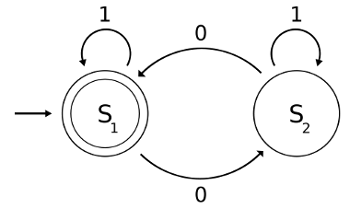

# 8. Konečné automaty

> Definice konečného automatu, jazyky rozpoznávané konečnými automaty.

## Formální definice

Konečným automatem je

, kde

-  je konečná množina všech stavů (stavový prostor),

-  je konečná množina vstupních symbolů (abeceda),

-  je přechodová funkce,

  

  

-  je počáteční stav,

-  je množina koncových stavů.

### Přeloženo

Konečný automat (KA) je reprezentován pomocí stavů. Je schopen pracovat s nějakými vstupními znaky, kterým se říká abeceda. Ze vstupu čte postupně znaky této abecedy. S každým přečtením znaku se může přesunout do jiného vnitřního stavu. Jeden z těchto stavů se označí za vstupní - tam automat začíná svojí činnost. Některé (lze i žádné) stavy se označí jako koncové. Pokud se automat dostane do koncového stavu, ukončí svoji činnost a vstupní slovo (posloupnost znaků dané abecedy) bylo rozpoznáno (akceptováno).

## Jazyk rozpoznávaný KA

Množina všech slov, které je schopen KA  rozpoznat tvoří jazyk . Formálně:

Jazyk  je **rozpoznatelný** KA, jestliže existuje KA  takový, že .

Jazyky, které KA rozpoznávají jsou **regulární**. Viz .

## Reprezentace automatu

Následující KA rozpoznává binární čísla, která mají sudý počet nul. 

KA je možné reprezentovat několika způsoby.

1. Formální zápis

  

  

  

  

  

2. Stavovým diagramem

  

3. Tabulkou

  | &nbsp; |  0  |  1  |
  | --- | --- | --- |
  |  |  |  |
  |  |  |  |

  Pomocí šipek se označí stav jako vstupní (), výstupní () nebo vstupní i výstupní zároveň ().

4. Stavovým stromem

  

## Nerodova věta

## Nedeterministické automaty

TODO převod nedeterministického automatu na deterministický?

## Porovnání síly konečných automatů

TODO inteligentnejsi nadpis?

Turingův stroj je nejsilnější a dokáže realizovat libovolný algoritmus.

Slabším nástrojem je zásobníkový automat (KSZ1).

Poté jsou konečné automaty, které jsou schopny rozpoznávat regulární jazyky.

Konečné automaty jsou silnější nástroj než kombinační logika.

## Uzávěrové vlastnosti

TODO uvadet?

