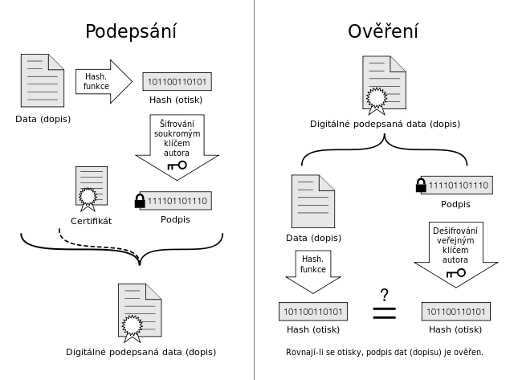
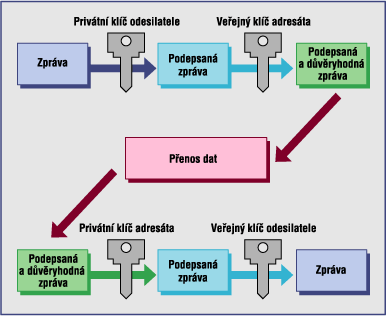

# 11. - Pojmy šifrování
> Pojmy šifrování, kódování, symetrické šifry (afinní, Vigener, Hill, jednoduchá transpozice), asymetrické šifry (RSA), Feistelovy šifry, princip, příklady (DES, AES, NDS).

## Základní pojmy
**Kryptologie** je věda, která se zabývá šifrováním (kryptos = skrytý), její části jsou:

- **kryptografie** - věda o tvorbě šifer, využívá šifrování k ukrytí dat
- **kryptoanalýza** - věda o jejich luštění, zabývá se hledáním způsobu jak šifrované zprávy dešifrova (hledání klíče nebo systému)

**Steganografie** je věda, která se zabývá ukrýváním zprávy, spadají sem různé mikrofilmy a neviditelné inkousty.

Rozlišujeme dva procesy:

- **Šifrování** je proces, který převádí čitelnou zprávu neboli *prostý text* na její nečitelnou podobu neboli *šifrový text*.
- **Dešifrování** je pak proces opačný.

**Kryptosystém** je systém umožňující šifrování a dešifrování zpráv. Bezpečnost šifrovacího systému není závislá na utajení šifrovacího algoritmu.

**Klíč** je tajná informace, bez níž nelze šifrový text přečíst.

**Kompromitace** je ztráta klíče jiným způsobem než kryptoanalýzou.

Šifra může být:

- **Bloková šifra** šifruje a dešifruje zprávu po stejně velkých blocích.
- **Proudová šifra** šifruje zprávu bit po bitu tak, jak do šifrátoru přichází. Šifrovací klíč může být periodicky opakován.

Nebo také:

- **Symetrická šifra** je taková, která pro šifrování i dešifrování používá tentýž klíč. Symetrický šifrovací systém je nejpoužívanější typ šifrovacího algoritmu. Tento systém je velmi rychlý a používá se při velkém množství dat.
- **Asymetrická šifra** používá veřejný klíč pro šifrování a soukromý klíč pro dešifrování. Asymetrický šifrovací systém je založen na principu jednocestné funkce. Pro všechna x lze vypočítat y=f(x), ale pro všechna y se nedají vypočítat x.

O šifrovacím algoritmu můžeme prohlásit:

- **Šifrovací algoritmus může být zlomen** - znamená, že s dostatkem času a prostředků může být nalezen způsob jak dešifrovat jím zašifrované zprávy.
- **Prakticky nezlomitelný** - je znám postup jak se domoci otevřeného textu, ale ne v rozumném čase (se současnou technologií a znalostmi!).

Asi nejjednoduší metodou zlomení některých šifer je **frekvenční analýza**. Pokud víme, v jakém jazyce byl napsán otevřený text, tak zároveň známe percentuelní zastoupení písmen v otevřeném textu. Pokud  zjistíme frekvenci písmen v zachyceném šifrovaném textu, tak prostým porovnáním frekvencí znaků zjistíme posun. Se znalostí posunu jsme schopni dešifrovat zachycený text.

**Moderní kryptografie je postavena na pricipu, že dvě prvočísla umíme snadno vynásobit, ale jejich faktorizace (rozklad na prvočísla) je výpočetně velmi složitý (u dostatečně velkých čísel).**

## Šifrování vs kódování
**Šifrování** si klade za cíl převest prostý text do takové podoby (šifrovaný text), tak aby nebylo možné ho bez znalosti klíče přečíst.

**Kódování** je změna vstupní zprávy na zprávu jinou, narozdíl od šifrování není cílem zprávu utajit. Kódujeme za účelem:

- **zmenšení objemu** přenášené zprávy (*minimální kódy*)
- **zabezepečení** zprávy proti chybám (*opravné kódy*)

## Symetrické šifry
### Substituční šifry
#### Caesarova šifra
Caesarova šifra je jednoduchou substituční šifrou, jejíž princip spočívá v posunu každého písmene otevřeného textu o konstantní počet míst v abecedě. Ačkoliv se v době Julia Caesara používala jen varianta posunu o 3 písmena, tak název se Caesarova šifra používá pro všechny varianty tohoto šifrovacího systému.

#### Tabulka záměny
Šifrování pomocí tabulky záměny, které je založeno na záměně znaku za jiný bez jakékoli vnitřní souvislosti či na základě znalosti klíče (hesla). Písmena v hesle se při vypisování zbylé abecedy vynechávají.

#### Affiní šifra
Afinní šifra je substituční šifra, která částečně eliminuje zásadní nevýhodu Caesarovy šifry, kterou je málo možností transformace a tím i velmi primitivní kryptoanalýzu.

#### Hillova šifra

### Aditivní šifry
#### Viegnerova šifra
Jedná se o speciální případ polyalfabetické šifry, což znamená, že pro šifrování není použita celá abeceda. Caesarova šifra je speciálním případ Vigenèrovy šifry s heslem o délce jeden znak. Vigenèrova šifra používá heslo, jehož znaky určují posunutí otevřeného textu a to tak, že otevřený text se rozdělí na bloky znaků dlouhé stejně jako heslo a každý znak se sečte s odpovídajícím znakem hesla. Vigenèrova šifra způsobuje změny pravděpodobnosti rozložení znaků a tím podstatně znemožňuje kryptoanalýzu na základě analýzy četnosti znaků v textu.

### Transpoziční šifry
####Mřížka

### Blokové šifry
#### Feistelovo šifrování
#### DES
#### AES

## Asymetrické šifry
### RSA

## Extra

### Elektronický podpis

*Elektronický podpis*

### Asymetrická kryptografie v praxi

*Asymetrická kryptografie  v praxi*