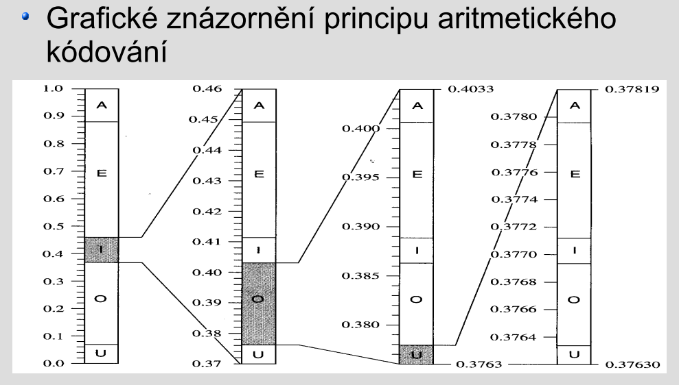

# 12. - Minimální kódy

> Minimální kódy, princip, použití, konstrukce Huffmanova kódu, aritmetické kódy

### Kódování

- Kódování je proces transformace dat (např. pomocí speciální znakové tabulky) do podoby definované příslušným kódovacím algoritmem, za účelem prevence ztráty (či znehodnocení) dat při přenosu nebo snížení celkového objemu dat apod.

**Kódování** je změna vstupní zprávy na zprávu jinou, narozdíl od šifrování není cílem zprávu utajit. Kódujeme za účelem:

- **zmenšení objemu** přenášené zprávy ( *kompresní kódy* - minimální(huffmanův kód), aritmetické, slovníkové)
- **zabezepečení** zprávy proti chybám (*opravné kódy* - CRC, Hamming, Paritní bit)

### Kraftova nerovnost

Kraftova nerovnost je věta užívaná v teorii kódování. Udává omezení na délky kódových slov, které musí splňovat daný kód, aby mohl být kódem prefixovým. Zobecnění Kraftovy nerovnosti pro libovolný jednoznačně dekódovatelný kód se pak nazývá McMillanova věta.

Matematicky lze Kraftovu nerovnost formulovat takto: Uvažujme D-znakový prefixový kód kódující  r různých zpráv pomocí kódových slov délek . Pak musí být splněna nerovnost

Naopak, pokud přirozená čísla  splňují výše uvedenou nerovnost, tak existuje prefixový kód s D znaky a délkami kódových slov .

#### McMillanova věta

McMillanova věta je tvrzení z oblasti teorie informace, které dává do vztahu délky kódových slov jednoznačně dekódovatelných kódů. Jedná se o zobecnění Kraftovy nerovnosti, která je primárně dokázána pro prefixové kódy (ty tvoří podmnožinu množiny jednoznačně dekódovatelných kódů). Větu lze vyslovit v následujícím znění:

Délky slov  libovolného jednoznačně dekódovatelného D-znakového kódu splňují nerovnost

#### Komprese dat

- algoritmy pro snížení objemu dat
	- ztrátová komprese (např. jpeg)
	- bezztrátová komprese (minimální kódy)

#### Prefixový kód

- žádné kódové slovo není prefixem jiného kódového slova
- každý prefixový kód je jednoznačně dekódovatelný
- lze je dekódovat znak po znaku(průběžně)

## Minimální(nejkratší) kód

- je prefixový kód, který má ze všech prefixových kódů dané zdrojové abecedy nejkratší střední délku kódového slova
- algoritmy snažící se bezztrátově zredukovat velké množství informace
- Statistické metody
	- Huffmanovo kódování
	- Aritmetické kódování
	- Shannon-Fanovo kódování
- Slovníkové metody
	- LZ77 (PNG)
	- LZ78
	- LZW (GIF)

### Huffmanův minimální kód  

- též známé jako prefixový kód
- využívá optimálního (nejkratšího) prefixového kódu  (kód žádného znaku není 
prefixem jiného znaku).
- **Princip**: Metoda je založená na stanovení četnosti výskytů jednotlivých 
znaků v kódovaném souboru a kódování znaků s největší četností 
slovem s nejkratší délkou. 

##### Algoritmus kódování: 

1. Zjištění četnosti jednotlivých znaků v kódovaném souboru (nebo absolutní počet) 
2. Vytvoření binárního stromu (Huffmanova kódu jednotlivých znaků) 
3. Ohodnocení uzlů stromu – přiřazení kódů 
4. Nahrazení znaků jednotlivými kódy (posloupností bitů) 

**Výhody**: velmi rychlá komprese a dekomprese, jednoduchý algoritmus \
**Nevýhody**: nutnost uložení binárního stromu nebo jiné informace pro jeho opětovné 
sestavení, slabší kompresní poměr 

**Příklad: znakový řetězec ABRAKADABRA**

1. Zjistím jednotlivé četnosti: A (5x – 0,46), B (2x – 0,18), R (2x – 0,18), D (1x – 0,09), K (1x – 0,09)
2. Sestrojím tabulku četností:
 - Levý sloupec seřazeno dle četnosti, dále pak podle abecedy. (závislé na implementaci)
 - Posledním dvou nejméně četným znakům přiřadím 0 a 1. (pořadí opět závislé na implementaci)
 - Do dalšího sloupce přesunu vyhodnocené znaky jako jeden složený a zbytek jen opíšu.
 - Opět vše seřadím a kroky opakuji analogicky až do konce.
3. Výsledný kód je spojením dílčích kódů vzniklých při spojování. (čteno odzadu) 
4. A(1), B(01), R(001), D(0000), K(0001)

| Četnost | Kód  | Četnost  | Kód | Četnost | Kód  | Četnost | Kód |
|--------|---|---------|---|----------|---|-----------|---|
| A 0,46 |   | A 0,46  |   | A 0,46   |   | DKRB 0,54 | 0 |
| B 0,18 |   | B 0,18  |   | DKR 0,36 | 0 | A 0,46    | 1 |
| R 0,18 |   | DK 0,18 | 0 | B 0,18   | 1 |           |   |
| D 0,09 | 0 | R 0,18  | 1 |          |   |           |   |
| K 0,09 | 1 |         |   |          |   |           |   |

Výsledný řetězec: **ABRAKADABRA** (11 znaků - 88 bitů) = 1 01 001 1 0001 1 0000 1 01 001 1 = **10100110001100001010011** (23 bitů)

Kompresní poměr: (nový počet bitů) / (původní počet bitů) = 23 / 88 = 0,26 = **26%**

*Výsledek je distribuován spolu s tabulkou kódu, díky prefixovosti je pak možné řetězec jednoznačné rekonstruovat opětovným přepsáním zpět.*

### Aritmetické kódování

- Aritmetické kódování reprezentuje zprávu jako podinterval intervalu <0,1)
- Výstupem je jedno racionální číslo a tabulka četností
	- pomocí tabulky zjistíme poměrné rozdělení jednotlivých znaků a následně z daného racionálního čísla sestavíme řetězec

