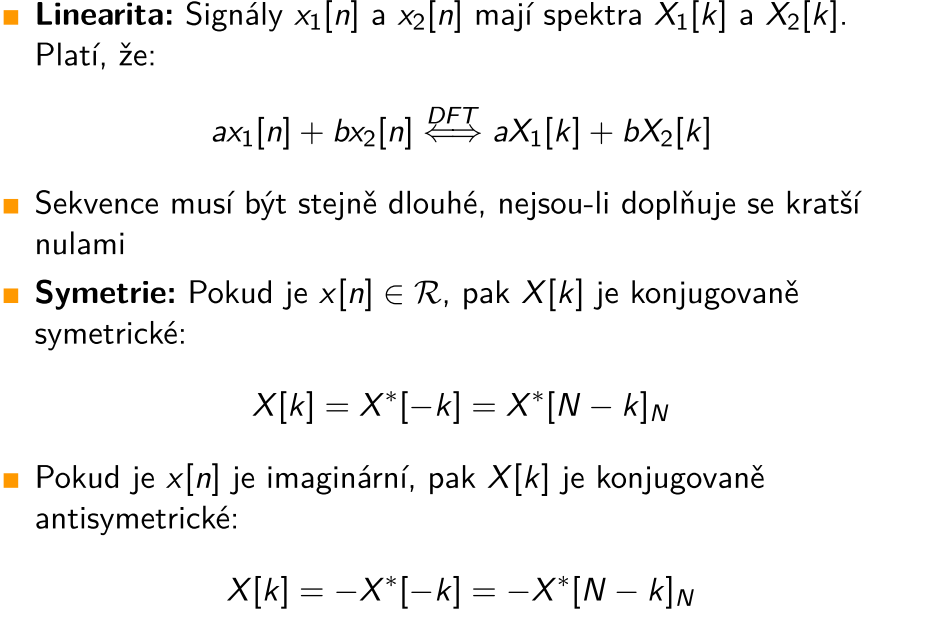
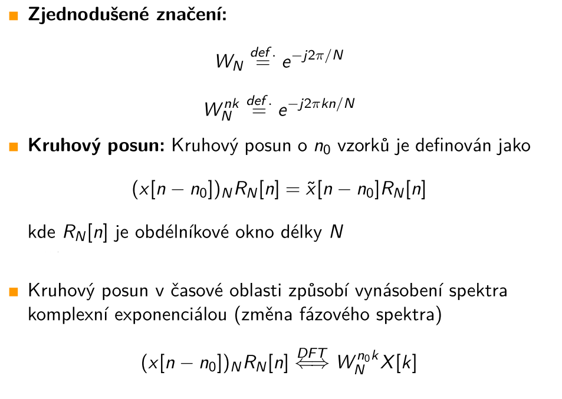
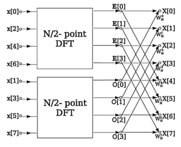
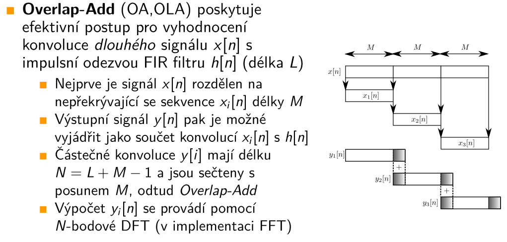

# 23. - DFT/FFT (radix-2)

> DFT/FFT (radix-2) - vlastnosti a výpočetní složitost, linearní a kruhová konvoluce, rychlý
výpočet lineární konvoluce pomocí FFT (metoda overlap-add, overlap-save).

## DFT a FFT

- Rychlá Fourierova Transformace (Fast Fourier Transform)
je skupina algoritmů umožňující výpočetně optimalizovaný
výpočet DFT a IDFT
- DFT se používá pro transformaci nekonečné (periodické) řady
čísel na nekonečný (periodický) vektor frekvenčních komponent
- Výpočetní náročnost DFT vypočtené podle definice je  aritmetických operací
	- FFT je schopna spočítat stejný výsledek v operacích
**Vlastnosti**

**Radix-2 Cooley-Tukey FFT** 

- je algoritmus určený pro sekvence délky 
- Výpočetních úspor je dosaženo díky periodicitě komplexních exponenciál a možnosti vypočítat N-bodovou DFT pomocí dvou N/2-bodových DFT
- Vyžaduje  komplexních součinů a  komplexních součtů

## Lineární a kruhová konvoluce

### Lineární konvoluce

![y[n] = x[n] * h[n] = \sum_{k=0}^{N-1}x[k]\cdot h[n-k]](https://latex.codecogs.com/svg.latex?y%5Bn%5D%20%3D%20x%5Bn%5D%20*%20h%5Bn%5D%20%3D%20%5Csum_%7Bk%3D0%7D%5E%7BN-1%7Dx%5Bk%5D%5Ccdot%20h%5Bn-k%5D)

- možné výpočty:
	- Posuvné pásky
	- Násobení polynomů
	- Kompozice posunutých impulzních odezev
- **Vlastnosti konvoluce**:
	- Komutativita: (Commutative property)
		-	x[n] ∗h[n] = h[n] ∗x[n]
	- Asociativita: (Associative property)
		- {x[n] ∗h1[n]}∗h2[n] = x[n] ∗{h1[n] ∗h2[n]}
		- Sériové zapojení systémů h1[n],h2[n] lze nahradit systémem s impulsní odezvou heq = h1[n] ∗h2[n]
	- Distributivita: (Distributive property)
		- x[n] ∗{h1[n] + h2[n]}= x[n] ∗h1[n] + x[n] ∗h2[n]
		- Paralelní zapojení systémů h1[n],h2[n] lze nahradit systémem s impulsní odezvou heq = h1[n] + h2[n]
		- 

Vysledek konvoluce = [1 3 6 10 9 7 4]

### Kruhová konvoluce

- Jsou-li x[n] a h[n] dvě konečné sekvence s N-bodovou DFT X[k] a H[k]
- pak sekvence s DFT rovnou Y [k] = H[k]X[k] je dána vztahem
- 
- Jedná se tedy o konvoluci h[n] s periodicky prodlouženým signálem x[n] vyhodnocenou na jedné periodě o délce N \
 
	- vezme se výsledek lineárni konvoluce, seřadí se 2x pod sebe a spodní se posune doprava o délku kruhové konvoluce
	- překrývající se sečtou a zbytek se opíše, dokud nedostanem (v tomhle případě) 4 čísla
	- výsledek kruhové konvoluce je tedy [10 10 10 10] 

- Kruhová konvoluce obecně NEMÁ stejnou hodnotu jako lineární  konvoluce
- Z kruhové konvoluce lze udělat lineární doplněním nul ke každému signálu 
	- potřebná délka = délka prvního + délka druhého - 1
	- v předchozím příkladu by se signály s délkou 4 doplnili 3 nulami, pak by kruhová konvoluce dala stejný výsledek jako lineární
	- 
- Při vhodném doplnění nulami se však používá právě pro rychlý výpočet lineární konvoluce (výstup z FIR filtru) pomocí DFT

## Rychlý výpočet lineární konvoluce pomocí FFT

Výpočet lin. konvoluce pomocí DFT:

1. Doplnit sekvence h[n] a x[n] nulami na délku 
2. Výpočet N-bodové DFT signálů h[n] a x[n]
3. Vynásobení Y [k] = H[k]X[k]
4. Inverzní transformace IDFT z Y [k]

Výpočet DFT je možné provést efektivně pomocí Rychlé  Fourierovy Transformace (FFT)	\
Tento postup je nevhodný pro dlouhé sekvence x[n]
	- Při vyhodnocování konv. sumy získáváme výsledek po vzorcích
	- Při výpočtu DFT výsledek celý najednou - zpoždění
	- Toto negativum se v praxi obchází blokovým výpočtem konvoluce
	- 
### Overlap-Add (Bloková konvoluce)

- základní princip je, že při kruhové konvoluci signálu s impulzní odezvou, vznikne část navíc (oproti délce vstupu)
- výsledkem blokové konvoluce Add je poskládání jednotlivých mezivýsledků  za sebe, s tím že překrývající části se sečtou

### Overlap-Save (Bloková konvoluce)

- k prvnímu rámci signálu se přidá zleva padding nul, aby se z kruhové konvoluce stala lineární
- v dalších rámcích se přidá na začátek místo nul poslední hodnoty z předchozího rámce
	- následně se pak v jednotlivých konvolucích přidané segmenty odstraní a mezivýsledky  se poskládají za sebe 

