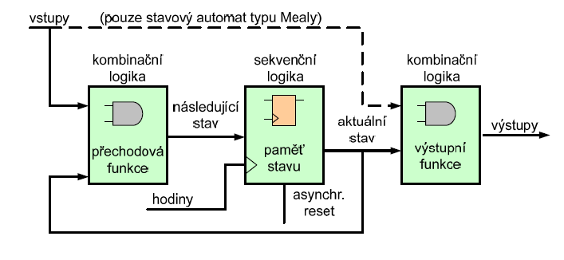
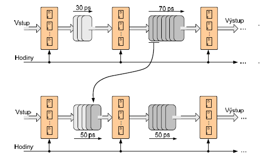
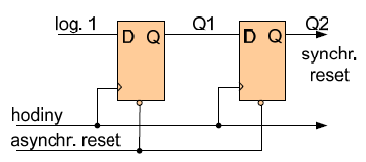

# 25. - Zásady návrhu elektronických systémů
>Zásady návrhu elektronických systémů (základní struktura systému, pravidla synchronního návrhu, přenos signálů mezi časovými doménami).

## Typické blokové schéma systému
Oddělení zpracování dat od řídicích obvodů (obecně rozdělení do několika relativně samostatných bloků).

Nejčastěji používáme úroveň RTL (Register Transfer Level).

- **Datová část** - v podstatě se jedná o střídání kombinační logiky (výpočetní jednotky) a registrů pro uchovávání dat.
- **Řídicí část** – opět se střídá kombinační logika (přechodové a výstupní funkce) s registry (pro vnitřní stav).

*Struktura návrhu*

Vzniká tak „sendvičová“ struktura registrů a kombinační logiky (přelévání dat mezi registry) – podpora v hardwaru FPGA (LE = LUT + klopný obvod).

### Návrh datové části
Datová část se obecně skládá z:

- výpočetních jednotek (ALU, MAC, …),
- registrů pro uchovávání proměnných (paměti, zásobníky),
- komunikačních datových sběrnic.

V datové části řešíme algoritmizaci (obecně dvěma krajními implementacemi – sériovou nebo paralelní).

### Návrh řídicí části
Řídicí část řešena:

1. pamětí s mikroprogramem (u velkých řadičů neúměrně roste potřebná paměť)
2. stavovým automatem (Moore, Mealy)
   - **Mealy** - výstup závisí na vstupu a současném stavu; obvykle méně stavů 
   - **Moore** - výstup závisí pouze na současném stavu, obvykle více stavů; o jeden takt spožděn

*Schéma řídicí části systému*

### Register retiming
Při návrhu komplikovaných desek, pracujících na vysoké taktovací frekvenci, je velmi zásadní délka jednotlivých kombinačních cest a případné rozdíly ve spoždění, které mohou způsobit nechtěnou změnu na výstupech hradel. Register retiming slouží k vyrovnání kombinačních logických cest mezi registry.

## Pravidla synchroního návrhu
**Časová doména** je část obvodu, jehož registry jsou buzeny stejným hodinovým signálem. Při přenosu mezi doménami se mohou objevovat **metastability**, jejich vlivy lze potlačovat různými **synchronizátory**.

**Metastabilitou** nazýváme neschopnost výstupu registru ustálit se na definované logické úrovni v přesně definovaném čase, obvykle za jednu hodinovou periodu. (na výstupu KO vzniká nedefinovaný stav, který mohou
následné vstupy vyhodnotit rozdílně)

Důsledkem metastabilit mohou vznikat:

- proudové špičky na napájení,
- nekorektní přechody mezi stavy stavových automatů,
- nekorektní hodnoty na sběrnicích.

Ukazuje se tedy, že nejlepším řešením je **navrhovat vše synchronně** (nejlépe 1 časová doména, případně důsledně oddělit jednotlivé časové domény):

- podpora v návrhových systémech
- snadno testovatelné
- odolnější vůči šumům (přeslechy, odrazy, hazardy, …)
- funkčnost nezávisí na konkrétním rozmístění a propojení
- funkční simulace souhlasí se simulací časovou

**Pravidla synchronního návrhu:**

- na hodinové vstupy všech prvků jsou přivedeny pouze hodinové signály (bez přídavné logiky)
- všechny klopné obvody jsou hranově řízené (ne hladinově řízené obvody latche)
- zpětné vazby v kombinačních obvodech se v návrhu nevyskytují (ZV vedou na asynchronní sekvenční logiku)
- asynchronní signály jsou synchronizovány

Výstupy z logiky (přenosy čítačů, výstupy dekodérů a apod.) nejsou použity jako hodinové signály.

## Přenos signálů mezi časovými doménami
Přenos mezi časovými doménami je obvykle nežádoucí a rozdílné časové domény je lepší vhodným návrhem eliminovat.

K přenosu lze v zásadě použít dvě možnosti:

- **Synchronizátory**
- **Fronta FIFO**

### Synchronizátory
Pro snížení pravděpodobnosti vzniku metastability se používají dvojnásobné (výjimečně i trojnásobné) synchronizátory
(synchronizační buňky). Mezi synchronizátory může být kombinační logika, ale neměl by se
signál větvit.

**Problém se synchronizací n-bit. sběrnic**

- vlivem nestejných zpoždění jednotl. bitů by mohlo dojít k zápisu nesprávné hodnoty
- je-li fclk1 ≤ fclk2, lze signálem EN potvrzovat platnost dat
- je-li fclk1 ≥ fclk2, nutno zavést zpětnou vazbu (handshake) – data se nesmí ztratit ani zdublikovat (req a ack je třeba přesynchronizovat) => pomalejší.

*Synchronizace sběrnice*

**Synchronizace asynchronního resetu**

Problém s uvolněním resetu s aktivní hranou hodin (nutno dodržet dobu zotavení po resetu – reset recovery time trr) – může vést na metastabilní chování.

*Asynchroní reset*

Zastavení hodinového signálu vkládáním logiky není vhodné, lze použít bloky DCM (Digital Clock Manager) či PLL.

**Resynchronizace asynchroních vstupů**

- synchronizace jednotným hodinovým signálem
- detekce úzkých pulsů

*Asynchroní vstup*

### Fronta
Pro přenos dat mezi časovými doménami lze použít fronty s využitím paměti FIFO s asynchronními hodinami (dual clock FIFO). Využíváme zejména v případě, kdy je zpoždění spojené s resynchronizací nepřípustné.

