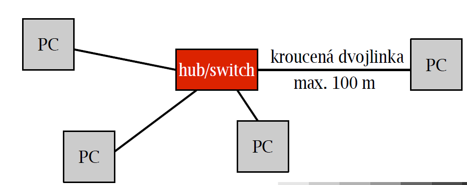
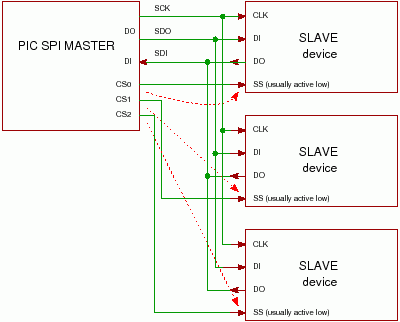
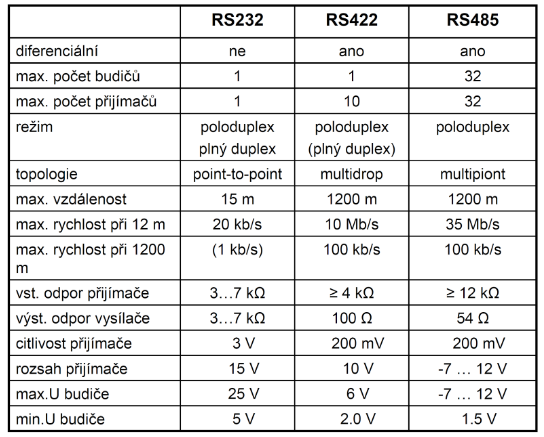
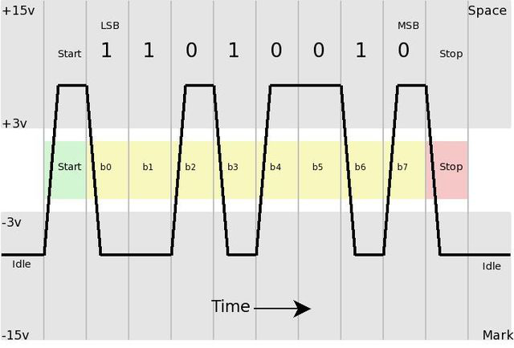
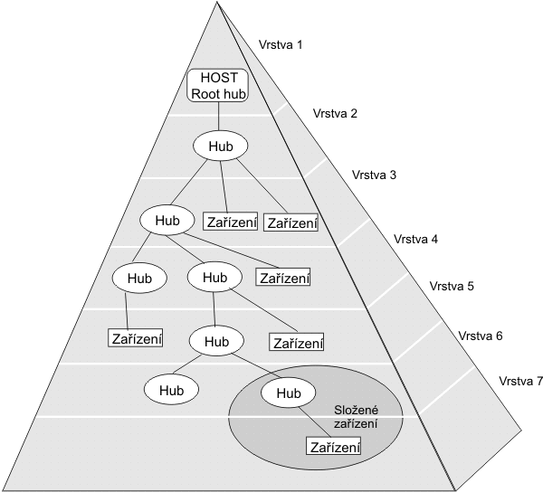

# 28\. - Průmyslové komunikační systémy

> Významné průmyslové komunikační systémy a sběrnice v počítačových systémech (CAN, Ethernet, Modbus, SPI, I2C, RS-232, USB, PCI-e, SATA), topologie, charakteristické vlastnosti.

**Průmyslové komunikační systémy** vznikly pro usnadnění řízení rozsáhlých procesů v průmyslu. Patří sem například strojní, letadlový, automobilový, potravinový průmysl atd.

Komunikační systémy pro tato odvětví by měly být:

- **robustní** - decentralizované řešení rozložené po celé "hale"
- **oddolné** - nutné rychlé a bezporuchové měření spolu s ovládáním akčních členů, to i v zarušeném prostředí
- **spolehlivé** - zpravidla nutnost dodržet zpracování v určitém intervalu (worst time)
- **dostupné** - používají se stovky metrů, cena tedy hraje významnou roli
- **flexibilní** - nutnost přizpůsobit systém požadavkům zákazníka

**Standard** nebo také norma je specifikace chování a vlastností, které zaručují kompatibilitu více systémů (různých implementací). Časté jsou různé standardizační komise, které zabraňují drahým vendor lockům.

**Protokol** je konvence nebo standard, podle kterého probíhá elektronická komunikace a přenos dat mezi dvěma koncovými body.

**Sběrnice** je skupina signálových vodičů, kterou lze rozdělit na skupiny řídicích, adresových a datových vodičů v případě paralelní sběrnice nebo sdílení dat a řízení na společném vodiči (nebo vodičích) u sériových sběrnic. Sběrnice má za účel zajistit přenos dat a řídicích povelů mezi dvěma a více elektronickými zařízeními. Přenos dat na sběrnici se řídí stanoveným protokolem.

**Dělení sběrnic**

- podle provozu

  - **synchronní**
  - **asynchronní**

- podle uspořádání

  - **sériové** (všechny uvedené)
  - **paralelní** (dnes již velmi málo používané)
  - **serioparalelní**

- podle směru přenosu

  - **jednousměrné**
  - **obousměrné**

- podle umístění

  - **intení**
  - **externí**

**Sériové sběrnice** jsou dnes používany téměř výlučně, důvody k postupnému ústupu paralelních sběrnic jsou v zásadě dva. Synchronizace přenosu jednotlivých bitů paralelně je při vyšších rychlostech a délkách vedení velmi složitá a narážíme zde na technologické limity (viz clock skew), proto může být sériová sběrnice na vyšších taktech paradoxně mnohem rychlejší. Vodiče pro sériovou komunikaci jsou podstatně tenčí a tedy praktičtější na dlouhé rozvody, to následně odráží na výsledné ceně použité kabeláže. Pro realizaci delších sběrnic se jedná o poměrně významný faktor. Pro sériové sběrnice je typická **arbitrace sběrnice** a **paketový systém komunikace**.

## Pomyslné rozdělení uvedených systémů

Uvedená směs sběrnic je hodně různoroda a můžeme jí rozdělit do několika pomyslných skupin podle specifického použití. (moje neoficiální dělení)

- **Průmyslové** (CAN, RS-485, RS-422, (průmyslový) Ethernet, RS-232)

  - pracují na vzdálenost desítek metrů
  - nejsou potřeba velké přenosové rychlosti
  - odolné proti rušení (kompromis na úkor přenosové rychlosti)
  - hardware je obvykle odolný na vysoké teploty, prach a elektromagnetické záření
  - povětšinou sériové (dlouhé paralelní sběrnice jsou drahé)

- **Mikrokontrolerové** (SPI, I2C)

  - komunikují na krátkou vzdálenost (mezi komponenty na desce nebo mezi systémy)
  - nenáročná implementace a integrace
  - realizováno na jednoduchém hardware
  - obvykle také sériové
  - nejsou potřeba velké přenosové rychlosti
  - obvykle spojené na pevno (nemá konektor)

- **Počítačové** (USB, PCI-e, SATA)

  - krátká až střední komunikační vzdálenost
  - obvykle velké nároky na přenosovou rychlost

## Používané systémy

**UART/USART**

Univerzální synchronní / asynchronní sériové rozhraní USART (Universal Synchronous / Asynchronous Receiver and Transmitter). Jde o zařízení pro sériovou komunikaci, které lze nastavit buď pro asynchronní režim (SCI – např. pro linky RS-232 resp. RS-485), anebo pro synchronní režim (běžně označovaný jako SPI). USART se od UARTu liší možností synchroní komunikace.

### CAN

CAN (Controller Area Network) je sběrnice typu multimaster, která je určena k propojování mikropočítačů, různých inteligentních čidel a akčních členů nejen v průmyslu, ale i v automobilech. Její základní koncepce je následující: Jednotlivé stanice připojené na sběrnici vysílají svá data bez ohledu na to, je-li v sytému nějaký „zájemce" nebo nikoliv. Datové rámce proto neobsahují adresu příjemce, nýbrž jen identifikaci která určuje, jaká data rámec obsahuje. Rámec je přijat všemi přijímači na sběrnici. Každý z přijímačů nezávisle použije identifikaci rámce k rozhodnutí, má-li být právě přijatý rámec akceptován, tj. předán k dalšímu zpracování nebo má-li být vymazán.

**Vrstvy**

- **Fyzická** a **Linková** vrstva (CAN Bosch)
- **Aplikační** vrstva (CANopen, DeviceNet)

**Linková vrstva:**

- CAN nepoužívá adresu ale identifikátor
- Každý uzel pomocí masky a filtru rozhodne, zda zprávu přijme či nikoli
- Tento způsob umožňuje zasílání zpráv pouze určitým skupinám uzlů
- Různé rámce mají různou prioritu, rámce s větší prioritou se dostanou na sběrnici rychleji a častěji
- **LLC – Logica Link Control**

  - Filtrování zpráv
  - Signalizace přetížení
  - Správa zotavování

- **MAC – Medium Access Control**

  - Zabalení dat do rámce / rozbalení dat z rámce
  - Kódování rámce (vkládání, vyhazování bitu)
  - Řízení přístupu k médiu
  - Detekce a signalizace chyb
  - Správa potvrzování příjmu
  - Serializace / deserializac

**Fyzická vrstva:**
 - Kódování / vzorkování bitu
 - Časování bitu
 - Synchronizace
 - Charakteristiky budičů
 - Konektory, kabely
 
Pracuje nad sběrnicí, k níž přistupuje metodou **CSMA/CD+AMP**

- CSMA - náhodný přístup k médiu
- CD - detekce kolizí
- AMP - Arbitration on Message Priority (řidí se prioritami zpráv)

Komunikace na sběrnici CAN probíhá tak, že každý uzel může za určitých okolností využívat sběrnici pro vysílání svých zpráv. Zpráva vysílaná po sběrnici obsahuje identifikační číslo vysílajícího uzlu. Identifikátor definuje nejen obsah zprávy, ale i prioritu přístupu na sběrnici. Tímto způsobem je možno zaslat zprávu z jednoho uzlu do jiného uzlu nebo několik jiných uzlů současně. Komunikační síť CAN může pracovat jak v režimu multi-master (více nadřízených uzlů), nebo v režimu master-slave (jeden uzel nadřízený a více podřízených uzlů).

_Typy CAN_

Komunikační protokol CAN definuje formát přenášených zpráv na aplikační úrovni. Zprávy jsou přenášené v tzv. rámcích. V definici CAN jsou určeny čtyři typy rámců:

- datový rámec (DATA FRAME)
- žádost o data (REMOTE FRAME)
- chybový rámec (ERROR FRAME)
- rámec přeplnění (OVERLOAD FRAME)

Datový rámec (**DATA FRAME**) Datový rámec zabezpečuje přenos informací z vysílajícího uzlu všem ostatním uzlům na sběrnici.

Žádost o rámec (**REMOTE FRAME**) Žádost o rámec má obdobný formát jako datový rámec. Uzel takto žádá některý jiný uzel na síti o vysílání datového rámce se shodným identifikátorem, jaký je v žádosti.

Chybový rámec (**ERROR FRAME**) Chybový rámec sestává z polí ERROR FLAG a ERROR DELIMITER. Uzel, který zjistí chybu v řetězci přijímaných bitů, začne vysílat 6 dominantních bitů, čímž poruší strukturu rámce. Ostatní uzly začnou též vysílat 6 dominantních bitů. Celková délka ERROR FLAG tak může být 6 až 12 bitů. Za nimi následuje pole ERROR DELIMITER s 8 recesivními bity.

Rámec přeplnění (**OVERLOAD FRAME**) Rámec přeplnění má obdobnou strukturu, jako chybový rámec. Uzel vyšle tento rámec především tehdy, když potřebuje určitý čas na zpracování předchozí zprávy.

**Výhody**

- Vysoká rychlost přenosu dat 1Mbit/s při délce sběrnice do 40m
- Rozlišení zpráv identifikátorem CAN 2.0A 11bitů a CAN 2.0B 29bitů
- Selekce přijímaných identifikátorů zpráv
- Prioritní přístup zabezpečující urychlené doručení významných zpráv
- Diagnostika sběrnice např.: chyba doručení zprávy, chyba CRC, přetečení bufferu
- Značná úroveň zabezpečení přenosu
- Vysoká provozní spolehlivost
- Stále se rozšiřující součástková základna
- Nízká cena

**Nevýhody**

- Omezený počet dat přenášených v rámci jedné zprávy (0 až 8 Byte)
- Prvotní náročnost nastavení registrů CAN sběrnice

### Ethernet

Ethernet je název souhrnu technologií pro počítačové sítě (LAN, MAN) z větší části standardizovaných jako IEEE 802.3, které používají kabely s kroucenou dvoulinkou, optické kabely (ve starší verzích i koaxiální kabely) pro komunikaci přenosovými rychlostmi od 10 Mbit/s po 100 Gbit/s. Sítě Ethernet realizují fyzickou a linkovou vrstvu referenčního modelu OSI.

- dříve na koaxiálním kabelu
- dnes kroucená dvoulinka (hvězdicová topologie - uprostřed hub/switch)

**V jednoduché sítí komunikují všichni na stejné sběrnici (fyzická topologie bus) a řeší se kolize při vysílaní paketů. Situaci zlepšují switche, které pakety filtrují do různých segmentů, aby nedocházelo neustále k blokování.**

**CSMA** (Carrier Sense Multiple Access) - stanice připravená vysílat data si "poslechne" zda přenosové médium (kabel) nepoužívá jiná stanice. V případě, že ano, stanice zkouší přístup později až do té doby dokud není médium volné. V okamžiku kdy se médium uvolní začne stanice vysílat svá data.

**CD** (Collision Detection) - stanice během vysílání sleduje zda je na médiu signál odpovídající vysílaným úrovním (tedy aby se např. v okamžiku kdy vysílá signál 0 nevyskytl signál 1). Případ kdy dojde k interakci signálů více stanic se nazývá kolize. V případě detekce kolize stanice generuje signál JAM a obě (všechny) stanice které v daném okamžiku vysílaly generují náhodnou hodnotu času po níž se pokusí vysílání zopakovat.

- připojením počítačů k switch mizí potřeba CSMA/CD přístupu a lze využít full duplxe provoz

_Ethernetový rámec_

**MAC adresy**
- 6 bajtů (48 bitů)
- zapisováno jako 6 dvojic šestnáckových číslic (00-02-c3-67-a8-3f)
- celosvětově jednoznačné
    - první polovinu přiděluje výrobci centrální autorita
    - druhou polovinu přiděluje výrobce každému zařízení

**Standardy**

- **Ethernet** Ethernet na koaxiálním kabelu nebo krocené dvoulince nebo optickém kabelu o rychlosti 10 Mbit/s. 
- **Fast Ethernet** Ethernet na krocené dvoulince nebo optickém kabelu o rychlosti 100 Mbit/s. 
- **Gigabitový Ethernet** Ethernet na krocené dvoulince nebo optickém kabelu o rychlosti 1 Gbit/s. 

### Modbus

MODBUS je otevřený protokol pro vzájemnou komunikaci různých zařízení (PLC, dotykové displeje, I/O rozhranní apod), který umožňuje přenášet data po různých sítích a sběrnicích (RS-232, RS-485, Ethernet TCP/IP, MODBUS+ atd.). Komunikace funguje na principu předávání datových zpráv mezi klientem a serverem resp. masterem a slavem. Na sběrnici je jedno „master" zařízení (v případě verze Modbus TCP jich může být více) posílající dotazy, ostatní zařízení jsou „slave". „Slave" zařízení odpovídá na dotazy, které jsou mu adresovány. V pozici mastera je tedy řídící prvek (např. PLC nebo průmyslové PC), v roli slave zařízení jsou ovládané nebo sledované prvky (např. čidla, měřící přístroje, PLC, prvky výrobních linek atp.). Komunikace probíhá metodou požadavek-odpověď a požadovaná funkce je specifikována pomocí kódu funkce jež je součástí požadavku.

**Uzly**

- Master – jediný uzel na sběrnici, nemá přiřazenou adresu, inicializuje přenos
- Slave – 1 až 247 uzlů, každý slave musí mít jedinečnou adresu v rozmezí 1 až 247

  - nemůže vysílat data bez přijetí požadavku od Master uzlu
  - nemůže komunikovat s jiným slave uzlem

Protokol Modbus definuje dva sériové vysílací režimy, Modbus RTU a Modbus ASCII. Režim určuje, v jakém formátu jsou data vysílána. Každá jednotka musí podporovat režim RTU, režim ASCII je nepovinný. Všechny jednotky na jedné sběrnici musejí pracovat ve stejném vysílacím režimu.

- **MODBUS RTU** – V režimu RTU se 8bitový byte vysílá jako jeden znak, integrita zpráv je zajištěna pomocí kontrolního součtu typu CRC a pomocí paritního bitu. Vysílání zprávy musí být souvislé, mezery mezi znaky nesmějí být delší než 1,5 znaku. Začátek a konec zprávy je identifikován podle pomlky na sběrnici delší než 3,5 znaku. Časování a definice protokolu zajišťuje rychlou komunikaci a spolehlivou komunikaci po sběrnici RS485, aniž by byly kladeny přehnané nároky na připojená zařízení. Díky svým dobrým vlastnostem a otevřenosti patří MODBUS RTU k nejrozšířenějším komunikačním standardům pro průmyslovou automatizaci.
- **MODBUS ASCII** – V režimu ASCII je každý 8bitový byte posílán jako dvojice ASCII znaků. Oproti režimu RTU je tedy pomalejší, ale umožňuje vysílat znaky s mezerami až 1 s. Začátek a konec zprávy je totiž určen odlišně od RTU módu. Začátek zprávy je indikován znakem „:" a konec zprávy dvojicí řídicích znaků CR, LF. Tato verze protokolu je tak „lidsky čitelnější", ale proti RTU verzi je málo využívaná.

**Datagram**

_MODBUS datagram_

V soušasné době jsou implementována MODBUS komunikace po sítích:

- TCP/IP Ethernet
- Asynchronní sériový přenos ( RS - 232C, RS - 422, RS - 485, vlákno, radiový přenos )
- MODBUS PLUS vysokorychlostní síť

### SPI

Sběrnice SPI (_Serial Peripheral Interface_) představuje jednu z forem sériových externích sběrnic sloužících pro vzájemné propojení dvou či více komunikujících uzlů, přičemž jeden uzel obvykle vystupuje v roli takzvaného řadiče sběrnice (**master**), ostatní uzly pracují v režimu **slave**. Uzel, který pracuje jako master, obsahuje generátor hodinového signálu, který je rozveden do všech ostatních uzlů, čímž je umožněn zcela synchronní (navíc ještě obousměrný) přenos dat. Hodinový signál je rozváděn vodičem označovaným symbolem **SCK**. Kromě vodiče s hodinovým signálem jsou uzly propojeny dvojicí vodičů označovaných většinou symboly **MISO** (Master In, Slave Out) a **MOSI**(Master Out, Slave In), pomocí nichž se obousměrně (**full duplex**) přenáší data. Posledním signálem, který se u této sběrnice používá, je signál **SSEL** (Slave Select), jenž slouží – jak již jeho název napovídá – k výběru některého uzlu pracujícího v režimu slave. V následujících kapitolách si ukážeme, jak a kdy se tento signál používá. Všechny čtyři signály – **SCK**, **MISO**, **MOSI** i **SSEL**, pro svoji funkci vyžadují pouze jednosměrné porty, což přispívá k jednoduché a především levné implementaci této sběrnice.

- oddělený datový signál mastera od datového signálu slave (MOSI, MISO) (full-duplex)
- sériové, synchronní
- mono-master(jeden master, více slavů)

**Kde se používá:**

- Analogové ADC, DAC
- Paměti EEPROM, FLASH
- Řadiče CAN, USB, UART
- Budiče LED, LCD
- CPU supervizory
- RTC obvody
- I/O expandery

_Způsob komunikace s více zařízeními pomocí výběru uzlu signálem SSEL. Čím více existuje uzlů typu slave, tím větší množství pinů CSx je nutné použít. Vzhledem k tomu, že v danou chvíli může být vybrána jen jedna komunikující dvojice uzlů, lze mezi uzel typu master a ostatní uzly vložit demultiplexor pracující v režimu výběru „jedna z n"._

_Propojení zařízení do řetězu (daisy chain) vede ke snížení požadovaného počtu vodičů, ale také k prodloužení cesty (a tím i času) dat při jejich vysílání a příjmu. V případě, že jedno z připojených zařízení nebude funkční, celý řetězec se rozpadne._

### I2C

I2C je zkratka z celého názvu _Inter-Integrated Circuit_. V určitých ohledech se jedná o sběrnici podobnou SPI (existence hodinového signálu, jediný uzel typu master), ovšem některé vlastnosti těchto sběrnic jsou odlišné. Zatímco u sběrnice SPI byl umožněn obousměrný přenos dat díky použití dvojice vodičů MISO a MOSI, je sběrnice I2C vybavena „pouze" jedním datovým vodičem **SDA** (**SCL** (Synchronous Clock)), z čehož vyplývá, že se data přenáší **poloduplexně**. Také to znamená poněkud složitější interní strukturu všech připojených zařízení, protože příslušné piny musí být možné přepínat ze vstupního režimu na režim výstupní. Též zde není použit výběr zařízení typu slave pomocí zvláštních signálů, protože každému uzlu je přiřazena jednoznačná adresa - kromě elektrických charakteristik je totiž přesně stanoven i komunikační protokol, což je další rozdíl oproti výše popsané sběrnici SPI. Obecně je možné říci, že I2C je sice poněkud složitější, ale zato flexibilnější sběrnice, která se velmi často používá i pro komunikaci na delší vzdálenosti (řádově metry, viz například DDC u monitorů), než tomu je u sběrnice SPI.

- jediná datová linka (Serial Data Line) (half-duplex)
- sériové, synchronní
- halfduplex
- může být multi-master
- pevný protokol (startovní, ukončovací podmínka => podmínky generuje master)
- až 128 různých zařízení
- individuální adresu o délce 7 (128 zařízení) nebo 10 bitů (1024 zařízení) pro všechna zařízení

**Kde se používá:**

- Analogové ADC, DAC
- Paměti EEPROM, FLASH
- Řadiče CAN, USB, UART
- Budiče LED, LCD
- CPU supervizory
- RTC obvody
- I/O expandery

**Řízení komunikace**

Pro řízení komunikace se na I2C používá metoda s detekcí kolize. Každá ze stanic může zahájit vysílání, je-li předtím sběrnice v klidovém stavu. Během vysílání musí neustále porovnávat vysílané bity se skutečným stavem SDA. Je-li zjištěn rozdíl mezi očekávaným a skutečným stavem linky SDA, je to indikace kolize mezi několika stanicemi.

**Adresace**

Každá stanice připojená na I2C má přidělenou 7 resp. 10 bitovou adresu. Po zachycení podmínky START porovnávají všechny obvody svou adresu s adresou, která je vysílána na sběrnici. Zjistí-li některý z obvodů shodu, je vysílání určeno právě jemu a musí přijetí adresy potvrdit bitem ACK. Potom přijímá nebo vysílá další data.

**Potvrzování**

Každý vysílaný byte a vyslaná adresa je následována vysláním jednoho bitu ACK. Vysílající stanice jej vysílá v úrovni H. Přijímající stanice potvrzuje přijetí tím, že v době vysílání ACK připojí SDA na úroveň L. Pokud vysílající stanice nedostane potvrzení příjmu, ukončí vysílání podmínkou STOP.

_Zapojení uzlů na sběrnici I2C_

### RS-232

Standard RS-232, resp. jeho poslední varianta RS-232C z roku 1969, je postupně vytlačován výkonnějším USB. Nicméně v průmyslu je tento standard, především jeho modifikace - standardy RS-422 a RS-485, velice rozšířen a pro své specifické rysy tomu tak bude i nadále. Na rozdíl od komplexnějšího USB, standard RS-232 pouze definuje, jak přenést určitou sekvenci bitů a nezabývá se už vyššími vrstvami komunikace. V referenčním modelu ISO/OSI tak představuje pouze fyzickou vrstvu.

**RS232 je point to point, jeden drát pro příjem druhý pro vysílaní, zařízení si navzájem plní vstupně/výystupní buffery. Neřeší se tedy adresy a kolize.**

_Průběh signálu při přenosu znaku „K" (ASCII kód 75, binárně 01001011) bez parity a s jedním stopbitem._

### USB

USB (Universal Serial Bus) je univerzální sériová sběrnice, moderní způsob připojení periferií k počítači. Nahrazuje dříve používané způsoby připojení (sériový a paralelní port, PS/2, Gameport apod.) pro běžné druhy periférií. USB je sběrnice jen s jedním zařízením typu Master, všechny aktivity vycházejí z PC a je možné připojit až 127 různých zařízení. PC může požadovat data od libovolného zařízení, naopak žádné zařízení nemůže vysílat data samo od sebe. Veškerý přenos dat se uskutečňuje v tzv. rámcích, které trvají přesně 1 milisekundu. Uvnitř jednoho rámce mohou být postupně zpracovávány pakety pro několik zařízení. Přitom se mohou spolu vyskytovat pomalé (low-speed) i rychlé (full-speed) pakety. Rozhraní obsahuje 5V napájení a maximální proud 100mA, na požádání 500mA: Některé desky mají napájení přímo ze zdroje a není limitováno specifikací. Maximální délka kabelu je 5m.

Specifikace USB obsahuje čtyři základní typy datových přenosů:

- **Řídící** (control) přenosy jsou používány ke konfiguraci zařízení při jeho připojení a mohou být použity k dalším účelům, jako např. k řízení dalších komunikačních rour.
- **Hromadné** (bulk) přenosy slouží k přenosům velkého množství dat a jsou na ně kladena nejmenší omezení.
- **Přerušovací** (interrupt) přenosy slouží k včasnému a spolehlivému doručení dat, nejčastěji pro asynchronní události.
- **Izochronní** (isochronous) přenosy zabírají předem smluvené množství přenosového pásma a mají předem dohodnuté zpoždění. Tento druh přenosů je také nazýván proudový přenos v reálném čase (streaming real-time transfer).

_USB topologie_

**Plug and Play**

Výhodou je možnost připojování Plug and Play bez nutnosti restartování počítače nebo ručního instalování ovladačů. Zařízení lze připojit za chodu k počítači a během několika sekund je přístupné. Při připojení nového zařízeni nejprve hub podle zdvižené datové linky pozná, že se objevilo nové zařízení. Pak proběhnou následující kroky:

- Hub informuje hostitelský počítač o tom, že bylo připojeno nové zařízení.
- Hostitelský počítač se dotáže hubu, na který port bylo zařízení připojeno.
- Po doručení odpovědi vydá počítač příkaz tento port zapnout a provést vynulování (reset) sběrnice.
- Hub vyrobí nulovací signál (reset) o délce 10 ms. Uvolní pro zařízení napájecí proud 100 mA. Zařízení je nyní připraveno a odpovídá na implicitní (default) adrese.
- Než zařízení USB obdrží svou vlastní adresu sběrnice, je možno se na ně obracet přes implicitní adresu 0\. Hostitel si přečte první bajty popisovači zařízení, aby stanovil, jakou délku mohou mít datové pakety.
- Hostitel přiřadí zařízení jeho adresu na sběrnici.
- Hostitel si ze zařízení pod novou sběrnicovou adresou načte všechny konfigurační informace.
- Hostitel přiřadí zařízení jednu z možných konfigurací. Zařízení nyní může odebírat tolik proudu, kolik je uvedeno v jeho popisovači. Tím je připraveno k použití. Hostitel přiřadí zařízení jeho adresu na sběrnici.

**Vodiče**

Pro USB 2.0:

Pro USB 3.0:

1    | Vcc        | napájení
---- | ---------- | ---------------------------------------------
2    | D-         | rozdílový pár USB 2.0
3    | D+         | rozdílový pár USB 2.0
4    | GND        | zem napájení
5    | StdB_SSTX- | superrychlostní vysílač diferenciálního páru
6    | StdB_SSTX+ |
7    | GND_DRAIN  | zem signálu
8    | StdB_SSRX- | superrychlostní přijímač diferenciálního páru
9    | StdB_SSRX+ |
kryt | stínění    | kryt

- USB 3.0 je rychlé díky plně duplexnímu provozu, kde dva kabely jsou rezervovány pouze na odesílání dat a další dav kabely pouze pro příjem dat.

**Rychlosti**

Standart      | Rychlost
------------- | --------------------------
USB 1.1       | 12 Mbit/s
USB 2.0       | 480 Mbit/s
USB 3.0       | 5 Gbit/s
USB 3.1       | 10 Gbit/s

### SATA

Serial ATA (SATA) označuje v informatice počítačovou sběrnici, která využívá datové rozhraní pro připojení velkokapacitních paměťových zařízení, jako jsou pevné a optické disky. Délká kabelu je maximálně 1 metr.Topologie je point to point a každé zařízení je připojeno přímo do řadiče. SATA je fullduplexní a poskytuje vyšší výkon díky vestavěnému řadiči DMA.

Generace SATA | Standard      | Datovápropustnost | Frekvence
------------- | ------------- | ----------------- | ---------
1            | SATA 1,5 Gb/s | 150 MB/s          | 1,5 GHz
2            | SATA 3 Gb/s   | 300 MB/s          | 3 GHz
3            | SATA 6 Gb/s   | 600 MB/s          | 6 GHz

**PIO** (legacy podpora, nahrazeno DMA)

PIO (Programmed Input Output) je režim přenosů dat po sběrnici v počítači mezi periferiemi (CD-ROM, pevný disk, síťová karta apod.) a operační pamětí. Data jsou přenášena za účasti procesoru. Procesor je tedy plně zaměstnán přenosem a nemůže vykonávat jinou práci.

**DMA**

DMA (Direct Memory Access) je způsob přímého přenosu dat mezi operační pamětí a vstupně/výstupními zařízeními. Data neprocházejí skrze procesor a lze tak dosáhnout vyššího výkonu (během přenosu dat může procesor zpracovávat jiné strojové instrukce). DMA se používá pro přenos větších objemů dat například řadič pevných disků, grafická karta, síťová karta, zvuková karta a podobně. DMA je odchylkou od Von Neumannovy architektury počítače. DMA je řízené speciálním řadičem, který je součástí základní desky počítače.

**Ve standartu SATA**

_HotPlug_

Technologie Hot Plug umožňuje odpojit či připojit daný disk i za běhu a v případě podpory i při spuštěném operačním systému.

_NCQ_

NCQ (Native Command Queuing) je technologie, která v některých případech umožňuje zvýšit výkon pevných disků s rozhraním SATA. Při použití NCQ pevný disk sám optimalizuje pořadí, ve kterém jsou vykonány požadavky na zápis nebo čtení. Tato optimalizace může redukovat nadbytečný pohyb hlaviček disku. Tím se zvýší rychlost přenosu dat mezi řadičem a diskem a také se mírně sníží opotřebení disku.

**Specifikace datového vodiče** (SATA specifikuje i speciání napájecí konktor - neuveden)

Vodič | Funkce
----- | -------
1    | Zem
2    | DATA A+
3    | DATA A-
4    | Zem
5    | DATA B+
6    | DATA B-
7    | Zem

Existuje i varianta eSATA pro externí zařízení a eSATAp, která je i napájena.

### PCI-e

PCI-Express je standard **vysoko rychlostní** (**full duplex**) systémové sběrnice, který byl vytvořen jako náhrada za starší standardy PCI, PCI-X a AGP. Označení sběrnice není zcela správné, protože se jedná o **dvoubodové spoje**, na kterých jsou data přenášena **bez potřeby adresy** (adresace zařízení). Sběrnice PCI-Express používá **sériový přenos** dat (na rozdíl od svých předchůdců), protože to přináší proti paralelnímu přenosu některé výhody, zejména možnost dále zvyšovat frekvenci, na které sběrnice pracuje a tím i přenosovou rychlost.

Verze        | Propustnost 1x | Propustnost 4x | Propustnost 8x | Propustnost 16x
------------ | -------------- | -------------- | -------------- | ---------------
1.0          | 250 MB/s       | 1 GB/s         | 2 GB/s         | 4 GB/s
2.0          | 500 MB/s       | 2 GB/s         | 4 GB/s         | 8 GB/s
3.0          | 984.6 MB/s     | 3.938 GB/s     | 7.877 GB/s     | 15.754 GB/s
4.0 (future) | 1.969 GB/s     | 7.877 GB/s     | 15.754 GB/s    | 31.508 GB/s

PCI Express **Link** reprezentuje komunikační kanál mezi dvěma zařízeními sběrnice PCI Express. Základní PCI Express Link je sestaven ze dvou nízkonapěťových diferenciálních párů a to přijímacího a vysílacího komunikačního páru označovaného jako **Lane**. Činnost vysílače i přijímače je na sobě nezávislá a Link tvoří plně duplexní komunikační kanál.

- Základní link se skládá ze dvou jednosměrných diferenciálních párů v každém směru, reprezentující přijímací a vysílací pár. Hodinový signál je kódovaný do datového toku, aby mohlo být dosaženo maximální přenosové rychlosti. Samostatně vedené hodiny a data na vysokých frekvencích jsou náchylné k fázovému posunů a jitteru.
- Každý link může pracovat s příslušnými signálovými úrovněmi pro které byl navržen. Přenosová rychlost dle současné specifikace dosahuje 2,5Gbitu/s na jeden Lane v jednom směru. Zvýšení pracovní frekvence se předpokládá v dalších verzích specifikace.
- Každý Link musí podporovat **alespoň jeden Lane**. Pro zvýšení přenosové rychlosti je možné využít sdružování Lanes do Linků v povolené šířce. Obvykle se jedná o hodnoty **x1, x2, x4, x8, x12, x16 a x32**. Stejná šířka musí byt dodržena jak pro přijímací, tak vysílací část.
- Během hardwarové inicializace Linku se vyjedná pracovní frekvence a počet Lanes sestavujících Link. Obdoba vyjednávání pracovní frekvence sítí typu Ethernet.

- Zajímavé a užitečné je, že i v konektoru ×16 je možné použít kartu, která má menší počet drah (×1, ×2 atd.). Taková karta bude pracovat, i když samozřejmě na nižší rychlosti.*
